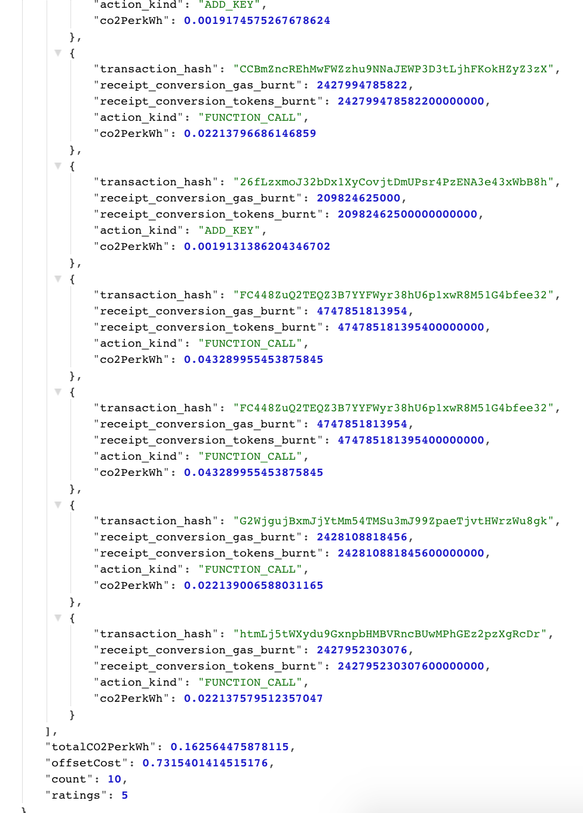

# NEAR CO2 API

REST API for NEAR account-level carbon emission



# Getting Started

```
~> git clone git@github.com:Zahidul-Islam/near-co2-api.git
~> cd near-co2-api
```

# Run

```
~> npm install
~> node
```
